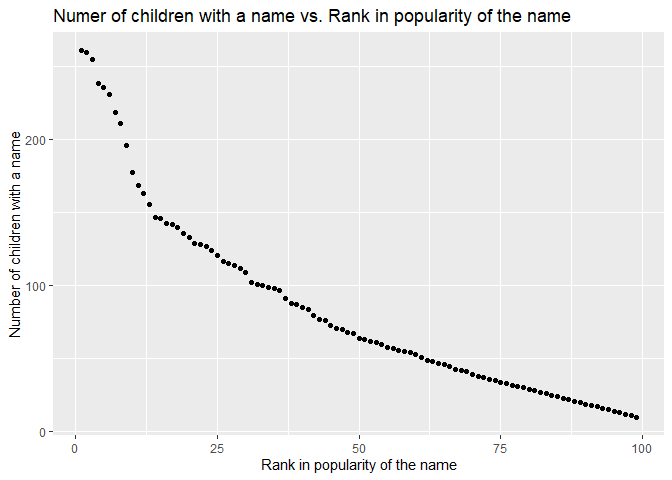

P8105\_hw2\_xh2470
================
Xueqing Huang xh2470

``` r
library(tidyverse)
```

    ## -- Attaching packages --------------------------------------- tidyverse 1.3.1 --

    ## v ggplot2 3.3.5     v purrr   0.3.4
    ## v tibble  3.1.4     v dplyr   1.0.7
    ## v tidyr   1.1.3     v stringr 1.4.0
    ## v readr   2.0.1     v forcats 0.5.1

    ## -- Conflicts ------------------------------------------ tidyverse_conflicts() --
    ## x dplyr::filter() masks stats::filter()
    ## x dplyr::lag()    masks stats::lag()

``` r
library(readxl)
options(warn = -1)
```

# Problem 1

Read and clean the Mr.Trash Wheel sheet.

``` r
trash_data = read_excel("./data/Trash-Wheel-Collection-Totals-7-2021-sept.xlsx", sheet = "Mr. Trash Wheel", range = "A2:N575") %>% 
  janitor::clean_names() %>% 
  drop_na(dumpster, month) %>%  # omit rows that do not include dumpster-specific data
  select(dumpster:homes_powered) %>% 
  mutate(sports_balls = round(sports_balls, digits = 0))
```

Read and clean precipitation data for 2018 and 2019, and combine them.

``` r
data_2018 = read_excel("./data/Trash-Wheel-Collection-Totals-7-2021-sept.xlsx", sheet = "2018 Precipitation", range = "A2:B14") %>% 
  janitor::clean_names() %>%
  drop_na(total) %>% 
  mutate(year = "2018")

data_2019 = read_excel("./data/Trash-Wheel-Collection-Totals-7-2021-sept.xlsx", sheet = "2019 Precipitation", range = "A2:B14") %>% 
  janitor::clean_names() %>%
  drop_na(total) %>% 
  mutate(year = "2019")

data_combine = 
  bind_rows(data_2018, data_2019) %>% 
  mutate(month = month.name[month]) %>% 
  relocate(year, month)
```

Write a paragraph of these data.

-   For Mr.Trash Wheel dataset, there are **486** rows and **14**
    columns. The number of observations is **486**. Variables contain
    *dumpster, month, year, date, weight\_tons, volume\_cubic\_yards,
    plastic\_bottles, polystyrene, cigarette\_butts, glass\_bottles,
    grocery\_bags, chip\_bags, sports\_balls, homes\_powered*. Examples
    of key variables are:

| dumpster | month | year | weight\_tons | plastic\_bottles |
|:---------|:------|-----:|-------------:|-----------------:|
| 1.0      | May   | 2014 |         4.31 |             1450 |
| 2.0      | May   | 2014 |         2.74 |             1120 |
| 3.0      | May   | 2014 |         3.45 |             2450 |
| 4.0      | May   | 2014 |         3.10 |             2380 |
| 5.0      | May   | 2014 |         4.06 |              980 |
| 6.0      | May   | 2014 |         2.71 |             1430 |

-   For the combined precipitation dataset of 2018 and 2019, there are
    **24** rows and **3** columns. The number of observations is **24**.
    Variables contain *year, month, total*. Examples of key variables
    are:

| year | month    | total |
|:-----|:---------|------:|
| 2018 | January  |  0.94 |
| 2018 | February |  4.80 |
| 2018 | March    |  2.69 |
| 2018 | April    |  4.69 |
| 2018 | May      |  9.27 |
| 2018 | June     |  4.77 |

-   The total precipitation in 2018 is **70.33**. The median number of
    sports balls in a dumpster in 2019 is **9**.

# Problem 2

First, clean the data in pols-month.csv.

``` r
pols_month = read_csv("./data/pols-month.csv") %>% 
  janitor::clean_names() %>% 
  separate(mon, into = c("year", "month", "day")) %>% 
  mutate(month = month.name[as.numeric(month)]) %>% 
  mutate(president = ifelse(prez_gop == 1, "gop", "dem")) %>% 
  select(-day, -prez_gop, -prez_dem) %>% 
  arrange(year, month)
```

    ## Rows: 822 Columns: 9

    ## -- Column specification --------------------------------------------------------
    ## Delimiter: ","
    ## dbl  (8): prez_gop, gov_gop, sen_gop, rep_gop, prez_dem, gov_dem, sen_dem, r...
    ## date (1): mon

    ## 
    ## i Use `spec()` to retrieve the full column specification for this data.
    ## i Specify the column types or set `show_col_types = FALSE` to quiet this message.

Second, clean the data in snp.csv.

``` r
snp = read_csv("./data/snp.csv") %>% 
  janitor::clean_names() %>% 
  separate(date, into = c("month", "day", "year")) %>% 
  mutate(year = paste0(ifelse(as.numeric(year) <= 15, "20", "19"), year)) %>% 
  mutate(month = month.name[as.numeric(month)]) %>%   
  select(-day) %>% 
  relocate(year) %>% 
  arrange(year, month)
```

    ## Rows: 787 Columns: 2

    ## -- Column specification --------------------------------------------------------
    ## Delimiter: ","
    ## chr (1): date
    ## dbl (1): close

    ## 
    ## i Use `spec()` to retrieve the full column specification for this data.
    ## i Specify the column types or set `show_col_types = FALSE` to quiet this message.

Third, tidy the unemployment data.

``` r
unemployment = read_csv("./data/unemployment.csv") %>% 
    pivot_longer(
      Jan:Dec, 
      names_to = "month",
      values_to = "percentage of unemployment"
    ) %>% 
    janitor::clean_names() %>% 
    mutate(
      month = month.name[as.numeric(match(month, month.abb))],
      year = as.character(year)
      ) %>% 
  arrange(year, month)
```

    ## Rows: 68 Columns: 13

    ## -- Column specification --------------------------------------------------------
    ## Delimiter: ","
    ## dbl (13): Year, Jan, Feb, Mar, Apr, May, Jun, Jul, Aug, Sep, Oct, Nov, Dec

    ## 
    ## i Use `spec()` to retrieve the full column specification for this data.
    ## i Specify the column types or set `show_col_types = FALSE` to quiet this message.

Fourth, join the datasets.

``` r
# Join dataset pols_month and snp first.
join_a = left_join(pols_month, snp, by = c("year", "month")) 

# Then join dataset unemployment
join = left_join(join_a, unemployment, by = c("year", "month"))
```

Write a paragraph of these data.

-   The dataset `pols_month` gives information about the number of
    democratic and republican politicians, which contain **822**
    observations and **9** variables. Variables contain *year, month,
    gov\_gop, sen\_gop, rep\_gop, gov\_dem, sen\_dem, rep\_dem,
    president*. The time is from 1947 to 2015, and the range is 68.

-   The dataset `snp` reveals information about Standard & Poor’s stock
    market index (S&P), which contain **787** observations and **3**
    variables. Variables contain *year, month, close*. The time is from
    1950 to 2015, and the range is 65.

-   The dataset `unemployment` shows percentage of unemployment in a
    given time, which contain **816** observations and **3** variables.
    Variables contain *year, month, percentage\_of\_unemployment*. The
    time is from 1948 to 2015, and the range is 67.

-   The dataset `join` combines the above three datasets, and contains
    **822** observations and **11** variables.The time is from 1947 to
    2015, and the range is 68. Examples of key variables are:

| year | month    | gov\_gop | sen\_gop | rep\_gop | gov\_dem | sen\_dem | rep\_dem | president | close | percentage\_of\_unemployment |
|:-----|:---------|---------:|---------:|---------:|---------:|---------:|---------:|:----------|------:|-----------------------------:|
| 1947 | April    |       23 |       51 |      253 |       23 |       45 |      198 | dem       |    NA |                           NA |
| 1947 | August   |       23 |       51 |      253 |       23 |       45 |      198 | dem       |    NA |                           NA |
| 1947 | December |       24 |       51 |      253 |       23 |       45 |      198 | dem       |    NA |                           NA |
| 1947 | February |       23 |       51 |      253 |       23 |       45 |      198 | dem       |    NA |                           NA |
| 1947 | January  |       23 |       51 |      253 |       23 |       45 |      198 | dem       |    NA |                           NA |
| 1947 | July     |       23 |       51 |      253 |       23 |       45 |      198 | dem       |    NA |                           NA |

# Problem 3

First, load and tidy the data.

``` r
baby = read_csv("./data/Popular_Baby_Names.csv") %>%
  janitor::clean_names() %>% 
  dplyr::distinct() %>% 
  mutate(
    ethnicity = recode(ethnicity, 
                       "ASIAN AND PACI" = "ASIAN AND PACIFIC ISLANDER",
                       "BLACK NON HISP" = "BLACK NON HISPANIC", 
                       "WHITE NON HISP" = "WHITE NON HISPANIC"),
    childs_first_name = str_to_title(childs_first_name)
  ) 
```

    ## Rows: 19418 Columns: 6

    ## -- Column specification --------------------------------------------------------
    ## Delimiter: ","
    ## chr (3): Gender, Ethnicity, Child's First Name
    ## dbl (3): Year of Birth, Count, Rank

    ## 
    ## i Use `spec()` to retrieve the full column specification for this data.
    ## i Specify the column types or set `show_col_types = FALSE` to quiet this message.

Produce table showing the rank in popularity of the name “Olivia” as a
female baby name over time.

``` r
Olivia = 
  baby %>% 
  filter(childs_first_name == "Olivia", gender == "FEMALE") %>%
  select(year_of_birth, ethnicity, rank) %>% 
  arrange(year_of_birth,ethnicity) %>% 
  pivot_wider(
    names_from = year_of_birth,
    values_from = rank
  )
```

| ethnicity                  | 2011 | 2012 | 2013 | 2014 | 2015 | 2016 |
|:---------------------------|-----:|-----:|-----:|-----:|-----:|-----:|
| ASIAN AND PACIFIC ISLANDER |    4 |    3 |    3 |    1 |    1 |    1 |
| BLACK NON HISPANIC         |   10 |    8 |    6 |    8 |    4 |    8 |
| HISPANIC                   |   18 |   22 |   22 |   16 |   16 |   13 |
| WHITE NON HISPANIC         |    2 |    4 |    1 |    1 |    1 |    1 |

Produce a similar table showing the most popular name among male
children over time.

``` r
male_name = 
  baby %>% 
  filter(gender == "MALE", rank == 1) %>%
  select(year_of_birth, ethnicity, childs_first_name) %>% 
  arrange(year_of_birth,ethnicity) %>% 
  pivot_wider(
    names_from = year_of_birth,
    values_from =  childs_first_name
  )
```

| ethnicity                  | 2011    | 2012   | 2013   | 2014   | 2015   | 2016   |
|:---------------------------|:--------|:-------|:-------|:-------|:-------|:-------|
| ASIAN AND PACIFIC ISLANDER | Ethan   | Ryan   | Jayden | Jayden | Jayden | Ethan  |
| BLACK NON HISPANIC         | Jayden  | Jayden | Ethan  | Ethan  | Noah   | Noah   |
| HISPANIC                   | Jayden  | Jayden | Jayden | Liam   | Liam   | Liam   |
| WHITE NON HISPANIC         | Michael | Joseph | David  | Joseph | David  | Joseph |

Finally, for male, white non-hispanic children born in 2016, produce a
scatter plot showing the number of children with a name (y axis) against
the rank in popularity of that name (x axis).

``` r
  baby %>% 
  filter(gender == "MALE", ethnicity == "WHITE NON HISPANIC", year_of_birth == 2016) %>%  
  ggplot(aes(x = rank, y = count)) + 
  geom_point() +
    labs(
    x = "The rank in popularity of the name",
    y = "The number of children with a name"
    )
```

<!-- -->
